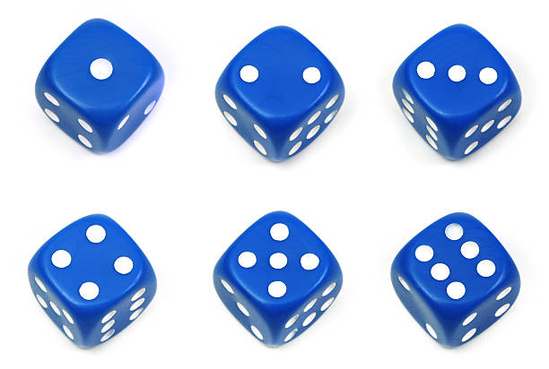
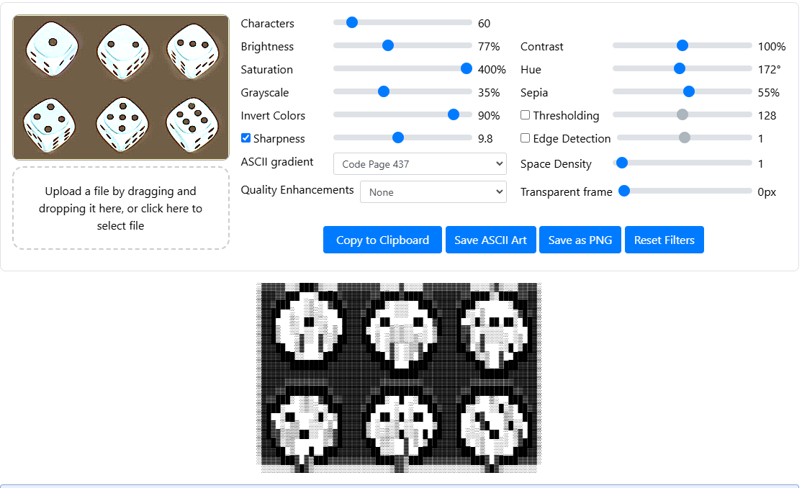

# Planning
## main.py
* Game loop
* User input
---
## game.py
* Scoring logic
* rolling dice, choosing scores
* Winner
---
## dice.py
* Generate dice
* Don't forget to keep chosen dice
---
## player.py
* Names
* (Scores)
* (Number of turns)
---
## scoreboard(.py)
* Might be a part of player.py
* Maybe save to either a txt or SQL file
* Neat lookn' so things such as '-', '_' and '|' as separators 
---
## util_and_config.py
* Error handling
* Change player count (or make this a choise when starting the came)
* Number of dice
* Rules (changing between maxi and normal yatzy)
---
# How we created the ascii dice art

First found a stuitable img for the ascii generator:


Then dialed it in for so that we got some decent results



### The results:
```

 ░░░░░░░▒███▓▒░░░░░░░░░░░░░░░░▒░░░░░░░░░░░░░░░░░░▒▓▒░░░░░░░ 
░▓▓▓▓▓███   ░████▓▓▓▓▓▓▓▓▓████▓████▓▓▓▓▓▓▓▓▓▓████▒░████▓▓▓▓░ 
░▓▓▓███        ▓██▓▓▓▓▓▓███░      ███▓▓▓▓▓▓███░      ░███▓▓░
░▓▓██     ░▒ ░   ██▓▓▓▓██░   ░░░    ██▓▓▓▓██░          ▓█▓▓░
░▓▓█   ░  ██░     █▓▓▓██  ██     ██  ▓█▓▓▓█  ░█▒ ██ ██░ ██▓░
░▓▓█   ░░    ░░   █▓▓▓█░             ░█▓▓▓█              █▓░
░▓▓█▒     ░░  ░ ▒██▓▓▓██ ░  ▒░▒░░  ░ ▒▓▓▓▓█▓▓░ ░░░░░  ░  █▓░
░▓▓▓██  ░▓   ▓ ░██▓▓▓▓▓██░ ░     ▒░ ██▓▓▓▓██▓  ▓    ░█ ▒██▓░
░▓▓▓▓███░░   ░███▓▓▓▓▓▓▓███ ▓░ ░▒ ▓██▓▓▓▓▓▓▓██▒░   ░  ███▓▓░
░▓▓▓▓▓▓████████▓▓▓▓▓▓▓▓▓▓▓███   ████▓▓▓▓▓▓▓▓▓▓██▒  ▓███▓▓▓▓░
░▓▓▓▓▓▓▓▓▓▓▓▓▓▓▓▓▓▓▓▓▓▓▓▓▓▓▓██████▓▓▓▓▓▓▓▓▓▓▓▓▓██████▓▓▓▓▓▓░
░▓▓▓▓▓▓▓▓▓▓▓▓▓▓▓▓▓▓▓▓▓▓▓▓▓▓▓▓▓▓▓▓▓▓▓▓▓▓▓▓▓▓▓▓▓▓▓▓▓▓▓▓▓▓▓▓▓▓░
░▓▓▓▓▓█████████▓▓▓▓▓▓▓▓▓▓▓█████████▓▓▓▓▓▓▓▓▓▓█████████▓▓▓▓▓░
░▓▓▓███░  ░  ▓██▓▓▓▓▓▓▓▓███░  █  ░███▓▓▓▓▓▓███▒  ▒   ███▓▓▓░
░▓███    ░▒░   ███▓▓▓▓▓██           ██▓▓▓▓██░    ░░█   ██▓▓░
░▓█  ░██    ░█░ ▒█▓▓▓▓██  ██ ░█ ░██  ██▓▓▓█  ░█     ░▒  ██▓░
░▓█          ░   █▓▓▓▓█              ▒█▓▓▓█    ▓█   ▒█   █▓░
░▓█▓ ░ ▒▒██░░  ▒ █▓▓▓▓█▒ ░ ░░▒█░░  █ ██▓▓▓█  ░ ░ ██   ░░ █▓░
░▓▓█▓░▒       ▒░▓█▓▓▓▓▓██ ░░     ▒ ▒██▓▓▓▓██░ ░     ░ ░▓██▓░
░▓▓▓██ ▒   █  ███▓▓▓▓▓▓▓██░░░  ▓  ███▓▓▓▓▓▓███ ▒  ░░  ███▓▓░
░▓▓▓▓███   ▒███▓▓▓▓▓▓▓▓▓▓████  ▒███▓▓▓▓▓▓▓▓▓▓███   ████▓▓▓▓░
 ░░░░░░▒▓█▓▒░░░░░░░░░░░░░░░░▒▓▓▒░░░░░░░░░░░░░░░▒▓█▓▒░░░░░░░ 
```


### Touched them up a bit:
```

 ░░░░░░░▒███▓▒░░░░░░░░░░░░░░░░▒░░░░░░░░░░░░░░░░░░▒▓▒░░░░░░░ 
░▓▓▓▓▓███   ░████▓▓▓▓▓▓▓▓▓████▓████▓▓▓▓▓▓▓▓▓▓████▒░████▓▓▓▓░
░▓▓▓███        ▓██▓▓▓▓▓▓███░      ███▓▓▓▓▓▓███░      ░███▓▓░
░▓▓██     ░▒ ░   ██▓▓▓▓██░   ░░░    ██▓▓▓▓██░          ▓█▓▓░
░▓▓█   ░  ██░     █▓▓▓██  ██     ██  ▓█▓▓▓█ ░██░ ██ ██░ ██▓░
░▓▓█   ░░    ░░   █▓▓▓█░             ░█▓▓▓█              █▓░
░▓▓█▒     ░░  ░ ▒██▓▓▓██ ░  ▒░▒░░  ░ ▒▓▓▓▓█▓▓░ ░░░░░  ░  █▓░
░▓▓▓██  ░▓   ▓ ░██▓▓▓▓▓██░ ░     ▒░ ██▓▓▓▓██▓  ▓    ░░ ▒██▓░
░▓▓▓▓███░░   ░███▓▓▓▓▓▓▓███ ▓░ ░▒ ▓██▓▓▓▓▓▓▓██▒░   ░  ███▓▓░
░▓▓▓▓▓▓████████▓▓▓▓▓▓▓▓▓▓▓███   ████▓▓▓▓▓▓▓▓▓▓██▒  ▓███▓▓▓▓░
░▓▓▓▓▓▓▓▓▓▓▓▓▓▓▓▓▓▓▓▓▓▓▓▓▓▓▓██████▓▓▓▓▓▓▓▓▓▓▓▓▓██████▓▓▓▓▓▓░
░▓▓▓▓▓▓▓▓▓▓▓▓▓▓▓▓▓▓▓▓▓▓▓▓▓▓▓▓▓▓▓▓▓▓▓▓▓▓▓▓▓▓▓▓▓▓▓▓▓▓▓▓▓▓▓▓▓▓░
░▓▓▓▓▓█████████▓▓▓▓▓▓▓▓▓▓▓█████████▓▓▓▓▓▓▓▓▓▓█████████▓▓▓▓▓░
░▓▓▓███░  ░  ▓██▓▓▓▓▓▓▓▓███░  █  ░███▓▓▓▓▓▓███▒  ▒   ███▓▓▓░
░▓██░    ██░   ███▓▓▓▓▓██           ██▓▓▓▓██░   ░░█   ██▓▓░
░▓█  ██     ██░ ▒█▓▓▓▓██   █ ░█ ░█   ██▓▓▓█  ░█     █▒  ██▓░
░▓█      ██  ░   █▓▓▓▓█              ▒█▓▓▓█     █    ▒█  █▓░
░▓█▓ ░ ▒▒░░    ▒ █▓▓▓▓█▒ ░ ░░▒█░░    ██▓▓▓█  ░ ░  █ ░░   ▓░
░▓▓█▓░▒       ▒░▓█▓▓▓▓▓██ ░░     ▒ ▒██▓▓▓▓██░ ░     ░ ░ ▓██░
░▓▓▓██ ▒      ███▓▓▓▓▓▓▓██░░░  ▓  ███▓▓▓▓▓▓███ ▒  ░░  ███▓▓░
░▓▓▓▓███   ████▓▓▓▓▓▓▓▓▓▓████  ▒███▓▓▓▓▓▓▓▓▓▓███   ████▓▓▓▓░
 ░░░░░░▒▓█▓▒░░░░░░░░░░░░░░░░▒▓▓▒░░░░░░░░░░░░░░░▒▓█▓▒░░░░░░░
```

### Then split them up and trimmed them:
1:
```
      ██▓▓██
    ██░  ░░███ 
  ███         ▓██ 
 ██     ░▒ ░   ██▓
▓█   ░  ██░     █▓
█   ░░    ░░   █▓
█▒     ░░  ░ ▒██    
 ██  ░   ░ ░ ██    
  ███░░   ░███    
    ████████    
``` 

2:
```
    ███▓▓▓███
  ███░      ███
 ██░   ░░░    ██
██  ██     ██  ▓█
█░             ░█▓
██ ░  ▒░▒░░  ░ ▒█▓
 ██░ ░     ▒░ ██▓
  ███ ▓░ ░▒ ▓██▓
    ███   ████▓
      ██████▓
```
3:
```
    ████▓▓████
 ███░      ░███
██░          ▓█▓
█ ░██░ ██ ██░  █▓░
█              █▓░
█▓▓░ ░░    ▒░  █▓░
██▓  ▓▒▒  ░░ ▒██▓░
  ██▒░   ░  ███▓
    ██▒  ▓███▓
     ▓█████▓
```
4:
```

  ███▓▓▓███    
 ███░  ░  ▓██ 
██░    ██░   ███   
█  ██     ██░ ▒█ 
█      ██  ░   █   
█▓ ░ ▒▒░░    ▒▓█ 
 █▓░▒      ▒░▓█
  ██ ▒      ███  
   ███   ████   
     ▓▓█▓▓   
```
 
5:
```
 
    ███▓▓▓▓███
  ███░  █  ░███▓
 ██           ██▓
██   █ ░█ ░█   ██▓
█              ▒█▓
█▒ ░ ░░▒█░░  ▒▒██▓
 ██ ░░     ▒ ▒██▓
  ██░░░  ▒▒ ███▓
   ████  ▒███▓
     ░░▓▓▒░░
```
  
6:
```

  ███▓▓▓▓▓██
 ███▒  ▒   ███
██░   ░░█   ██▓
█  ░█     █▒  ██
█     █    ▒█  █▓
█  ░ ░  █ ░░   ▓░
██░ ░     ░ ░ ▓██
▓███ ▒  ░░  ███
  ▓███   ████▓
    ░▒▓█▓▒░
```

## Realized how stupid they looked and made some neat dice
### Neat dice:
```
1
   _______
  /    ● /|
 /_●___ /●|
|      |●●|
|   ●  |●/
|______|/

2 
   _______
  /● ● ● /|
 /●_●_●_/●|
|    ● |●●|
|      |●/
|_●____|/

3
   _______
  /● ● ● /|
 /●_●_●_/●|
| ●    |  |
|   ●  |●/
|_____●|/

4
   _______
  / ●    /|
 /____● / |
| ●  ● |● |
|      | /
|_●__●_|/

5
   _______
  /● ● ● /|
 /●_●_●_/●|
|●   ● |● |
|  ●   |●/
|●___●_|/

6
   _______
  / ●    /|
 /____● /●|
| ●  ● |● |
| ●  ● |●/
|_●__●_|/
```

# Written report Yatzy Project
Max Morén and Teo Saveros
Grade: X

### Introduction

This project involves the development of a text based version of *Yatzy*. Yatzy is a popular dice game where players roll five dice and aim to score the highest points by achieving specific combinations such as "Fives", "Full House", "Three of a Kind" or "Yatzy". The goal is to fill out the scoreboard with as many points as possible.

In our project we developed a text based Yatzy game following the Swedish rule set. We build the game in Visual Studio Code to "easily" share the code between the both of us. Our Yatzy game include features like a dice rolling mechanism, player interactive elements to for example keep selected dice and to re-roll dice and an intuitive scoreboard interface. The game supports both a single-player experience and a multiplayer experience. Our programs interface has been designed to be simple to follow and engaging to use with the ASCII dice art.

### Discussion

##### How was rolling and re-rolling solved?

We made a for loop that rolled 3 times. Then we had if statements that check what could be done in that roll which then leads to the program asking the user what should be done on that roll. Either save some specific dice, save all or reroll all. After that is done the program states the available categories and ask which category to assign the scores to. 

##### If several players, how was that solved?

The initial design for us was for a multiplayer game but we first thought of creating a working single-player game to then continue building on to code support for multiplayer. But as we implemented the scoreboard and the way to get the player to have its own scoreboard we quickly realized that it would work for multiple players with a simple for loop that iterates over a input where the program ask how many players will be playing.
This loop is was the first step of getting multiplayer going.
```python
    for i in range(players): 
        player_name = input(f"Choose name for player {i + 1}: ")
        players_scoreboards[player_name] = scoreboard() #Assigns a individual scoreboard
        print(f"Current players: {list(players_scoreboards.keys())}")
```
 After that it was just finishing up the code around the rounds and making sure each player gets their turn. 

##### How was the scoreboard shown?

The scoreboard was shown in a table-like format with the 15 scoring categories from Yatzy. We created the scoreboard in a dictionary where the keys represent the categories(such as "Ones, Twos, "Threes", etc) and the values are the scores associated with the category. Using dictionary allows for easy access and updates of scores throughout the game.
The scoreboard can be viewed at any time while playing and it updates dynamically as the players assigns new scores to each category every round.

We created the "print_scoreboard" function which include the names of all players and their scores.

The function begins with calculating the width of each player's name and creating a header. The column widths are adjusted based on the length of each player's name to ensure a neat alignment 
```python
player_column_widths = {player: len(player) + 2 for player in player_names}
```
After setting up the column widths, the function prints the names of the players in the header. Then loops through each category and displays the current scores. If a category has not yet ben assigned with a score it shows "0" or "-" for crossed out values
```python
categories = list(scoreboard().keys())  # Get a list from categories from the scoreboard
for category in categories:
    print(f"\033[4m┃ {category:<16}\033[0m", end="\033[4m┃\033[0m")
    for player in player_names:
        score = players_scoreboards[player][category]
        score_str = f"{score}" if score is not None else 0
        score_str = "-" if score == 0 else score_str  # So crossed out values are more visible
        print(f"\033[4m{score_str:^{width}}┃\033[0m", end="")

```

##### How did you decide what categories were possible

max write pls

##### Reading and writing files?

First we find the file and check if there is previous scores already there and then we take those scores put them in a list. The new scores also gets in this list and the list get sorted from highest to lowest number.

##### Anything else that required a bit of thought

The first iteration of the scoreboard was a completely separate scoreboard for each player that got printed beneath each other. This was really ugly to look at and would have made the game more confusing while playing. After some thinking and testing we came up with the finalized scoreboard used in the game now. 

Creating dynamic lines for the scoreboard took some time.

### Lessons Learned

Visual studio code can be tricky sometimes with compiling and syncing code and we learned that patience is key. We learned that if you want something you can do this "[what u want to happen](what you want it happening to)". 

### Project Work

While working with this project we often organized the work accordingly to what we felt we were able to do each time we "met" and coded together. We broke the project into smaller pieces which both made it harder at times figuring out what to do first but also made it easier to figure out what should be where. We communicated every other day through discord and snapchat. Our estimate of how many hours we spent on this is roughly 20-30 hours each.


